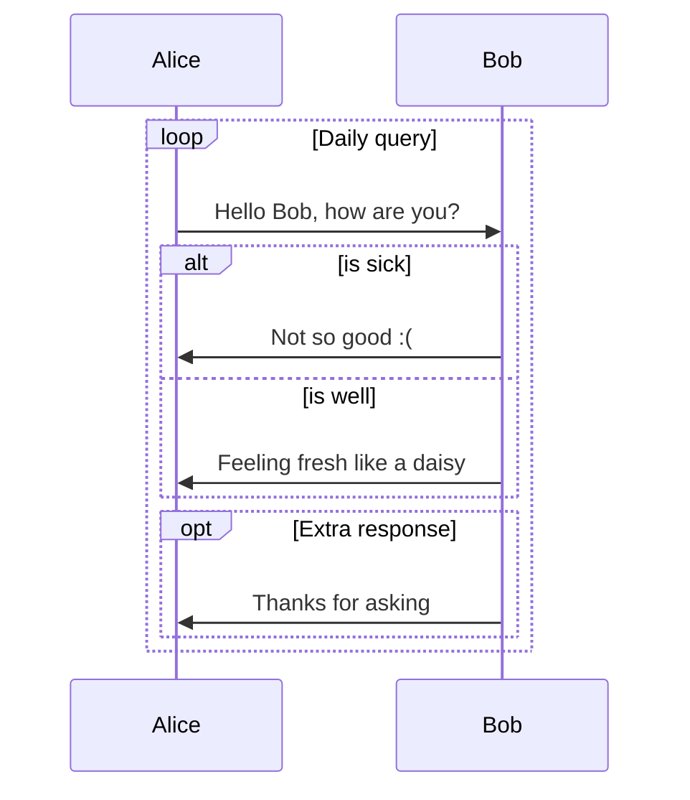
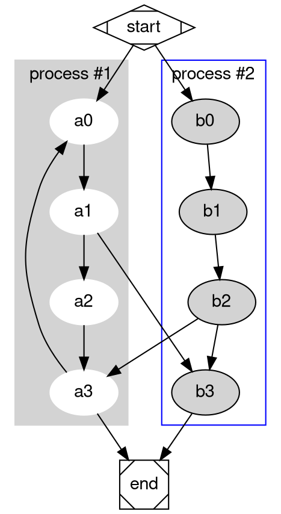

# テスト

テスト
テスト
テスト

## テスト

- test
  - test 

``` mermaid
sequenceDiagram
    loop Daily query
        Alice->>Bob: Hello Bob, how are you?
        alt is sick
            Bob->>Alice: Not so good :(
        else is well
            Bob->>Alice: Feeling fresh like a daisy
        end

        opt Extra response
            Bob->>Alice: Thanks for asking
        end
    end
```

test

```dot
digraph G {
	fontname="Helvetica,Arial,sans-serif"
	node [fontname="Helvetica,Arial,sans-serif"]
	edge [fontname="Helvetica,Arial,sans-serif"]

	subgraph cluster_0 {
		style=filled;
		color=lightgrey;
		node [style=filled,color=white];
		a0 -> a1 -> a2 -> a3;
		label = "process #1";
	}

	subgraph cluster_1 {
		node [style=filled];
		b0 -> b1 -> b2 -> b3;
		label = "process #2";
		color=blue
	}
	start -> a0;
	start -> b0;
	a1 -> b3;
	b2 -> a3;
	a3 -> a0;
	a3 -> end;
	b3 -> end;

	start [shape=Mdiamond];
	end [shape=Msquare];
}
```

